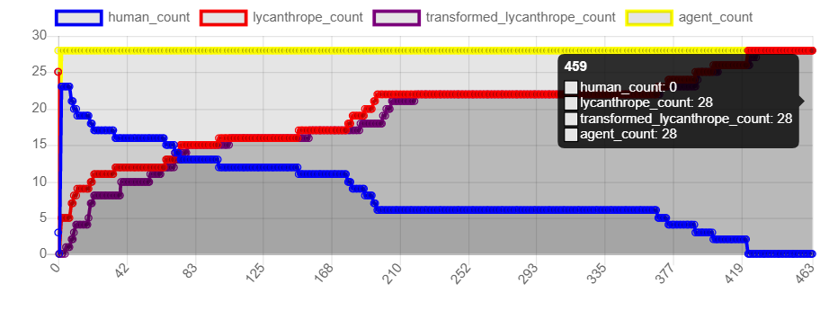

* Auteur : Thomas Nigoghossian

# Q 1
Pour attaquer les villageois, on utilise une list comprehension. On regarde pour tous les villageois du village, s'ils sont situés à une distance inférieure à la portée d'attaque du loup garou (qui forme un cercle).
On attaque ensuite aléatoirement l'un de ces agents avec une probabilité définie au préalable.

Cette capacité d'intéraction avec les autres agents est une des caractéristiques principales des agents. Bien qu'un agent doit être autonome, il doit être capable d'évoluer en fonction des actions des autres agents qu'il perçoit. Ici, c'est la contamination par un autre agent qui modifie son comportement.

Remarque : 
Dans l'énoncé, on parle d'une portée de 30 pour soigner et de 40 pour tuer. Je l'ai interprété comme précédemment c'est-à-dire la zone contenue dans un cercle de rayon 40 ( et non pas juste le cercle ).

# Q 2 

Le système semble converger vers un état homogène composé uniquement de lycanthropes transformés. La transformation complète de toute la population se fait en environ 400 étapes.

L'apothicaire semble ralentir la diffusion de la "maladie" au sein de la population. Sans apothicaire, on atteint en général l'état final plus rapidement que s'il était présent.

Le nombre de chasseur permet de réduire la population de lycanthropes. En effet avec 5 chasseurs, le modèle converge souvent vers des situations sans lycanthrope.

Inversement, si on augmente le nombre de lycanthropes, on observe une convergencec beaucoup plus rapide vers la population peuplée uniquement de lycanthropes. 

# Q 3

Sur la figure 1, on a représenté la situation "moyenne". C'est à dire qu'en moins de 100 itérations, il y a plus de loup-garous que d'humains. 

# Q 4

Maintenant si on augmente le nombre d'apothicaires, on se rend compte que cette transition se fait plus tardivement. (Environ vers 200 itérations cf figure 2.)

Cependant, les différentes simulations montrent que les apothicaires, peu importe leur nombre, ne viennent jamais à bout de l'épidémie, car ils n'ont pas de pouvoir sur les lycanthropes transformés.

Les chasseurs ont le même rôle que les apothicaires lorsqu'ils sont minoritaires dans la population. Ils ralentissent en effet la propagation des loup-garous. Néanmoins, lorsque les chasseurs sont très largement majoritaires (30 ici contre 5 loup garous), il est possible de converger vers un état stable sans ou avec peu de lycanthropes. Dans le cas où il reste des lycanthropes, ceux-ci évoluent principalement dans des coins, en marge du reste de la population.

# Q 5

Avec ces premières expériences, il y a un phénomène qui est mis en valeur. Bien que les lycanthropes sont minoritaires initialement, cela leur donne un avantage. Leurs "voisins" sont en majorité des cibles. Ils peuvent donc contanimer de nouvelles cibles à chaque tour. Tandis que les chasseurs par exemple sont entourés initialement en majorité d'humains. Ils n'ont donc aucune action possible.

Il serait intéressant d'augmenter la portée des chasseurs. Dans ce cas, il est probable que les chasseurs et apothicaires se débarrassent rapidement des lycanthropes. 

On pourrait aussi se pencher sur la probabilité d'attaque des chasseurs. En augmentant cette probabilité, on dimuerait la prolifération des lycanthropes car dès qu'un chasseur en croiserait un proche de la "communauté" qu'il protège, il serait éliminé.

# Q 6 

Hypothèse : Plus on augmente le nombre d'apothicaires et plus la population humaine reste majoritaire longtemps devant la population lycanthrope. Le chasseur peut éventuellement permettre de mettre fin à la population de lycanthrope, mais uniquement si le nombre d'apothicaire est suffisamment grand.

# Q 7

Résultats : 

|  | n_villagers | n_lp  |n_hunter  |n_cleric | Run | agent_count |human_count|  lycanthrope_count|  transformed_lycanthrope_count|
| -|------------ |:-----:|:--------:|:-------:|:---:|:-----------:|:---------:|:-----------------:|:-----------------------------:|
|0 |          50 |    5  |       1  |       0 |   0 |          56 |          0|                 56|                             56|
|1 |          50 |    5  |       1  |       1 |   1 |          57 |          0|                 57|                             57|
|2 |          50 |    5  |       1  |       2 |   2 |          58 |          0|                 58|                             58|
|3 |          50 |    5  |       1  |       3 |   3 |          58 |          0|                 58|                             58|
|4 |          50 |    5  |       1  |       4 |   4 |          56 |          0|                 56|                             56|
|5 |          50 |    5  |       1  |       5 |   5 |          61 |          0|                 61|                             61|

On remarque que le nombre d'apothicaires n'a que peu d'influence sur l'issue de la simulation. Il ne reste à la fin que des loups garous dans tous les cas. Les apothicaires sont inutiles dans notre modèle. (Du moins en petit nombre.)

# Bonus

Le problème qui arrive en faisant varier le nombre de paramètres de chaque type de classe est qu'on obtient une grande combinatoire de simulations à lancer.  Par exemple si chaque paramètre varie entre 5 valeurs, a la fin on a 5^4 = 625 simulations à réaliser. Or 5 simulations durent 15s, 625 dureraient environ 2h30.
Pour résoudre ce problème, on peut réduire la durée de la simulation. En effet, la plupart des simulations ont convergé au bout de quelques centaines d'étapes. Il n'est pas nécessaire d'aller jusqu'à 1000.
De plus, on peut effectuer du calcul parallèle étant donné que chaque simulation est indépendante. Cependant, sur les CPU, il n'y a que 4 coeurs en général, ce qui ne réduit pas suffisamment la durée totale. (Cette solution est implémentée par défaut dans batchrun) Il faudrait chercher à paralléliser sur GPU.

Enfin, on pourrait implémenter une méthode similaire au GridSearch sous scikit-learn. Il s'agit de ne pas réaliser toutes les simulations possibles mais échantillonner l'ensemble des combinaisons pour qu'on ne réalise pas des simulations voisines (variation d'un seul paramètre par exemple). En effet, les résultats des simulations sont censés être continus vis-à-vis des paramètres, c'est-à-dire que faire varier légérement un paramètre ne devrait modifier que légérement l'issue d'une simulation.

# Remarques Annexes

J'ai eu des problèmes lors de l'execution du script. Parfois, l'interface graphique ne se lance pas. La prise en main de la librairie mesa est un peu compliqué au début, notamment pour comprendre les méthodes des différentes classes. 

